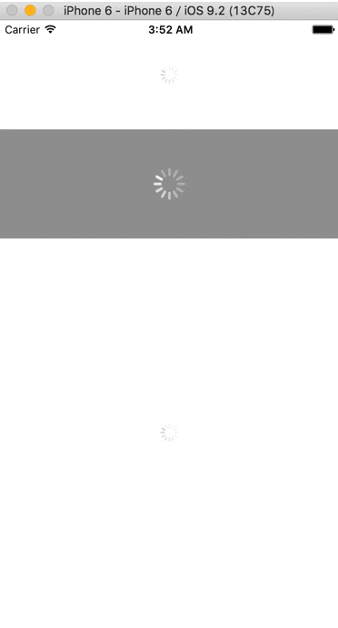

# Kazaguruma for Swift

[](https://github.com/Carthage/Carthage)
[](http://cocoapods.org/pods/Kazaguruma)
[](http://cocoapods.org/pods/Kazaguruma)
[](http://cocoapods.org/pods/Kazaguruma)

Kazaguruma is a loading indicator View that can be multiple display on the screen.



## Requirements

- iOS 8.0+
- Xcode 7.2+

## CocoaPods

Kazaguruma is available through [CocoaPods](http://cocoapods.org). To install
it, simply add the following line to your Podfile:


```ruby
pod "Kazaguruma"
```

Then, run the following code:

```ruby
$ pod install
```

## Carthage

[Carthage](https://github.com/Carthage/Carthage) is a decentralized dependency manager for Cocoa application.

``` bash
$ brew update
$ brew install carthage
```

To integrate Kingfisher into your Xcode project using Carthage, specify it in your `Cartfile`:

``` ogdl
github "nakajijapan/Kazaguruma"
```

Then, run the following command to build the Kingfisher framework:

``` bash
$ carthage update
```

## Usage

To run the example project, clone the repo, and run `pod install` from the Example directory first.


## Author

[@nakajijapan](https://twitter.com/nakajijapan), [@tarop](https://twitter.com/tarop)

## License

Kazaguruma is available under the MIT license. See the LICENSE file for more info.
